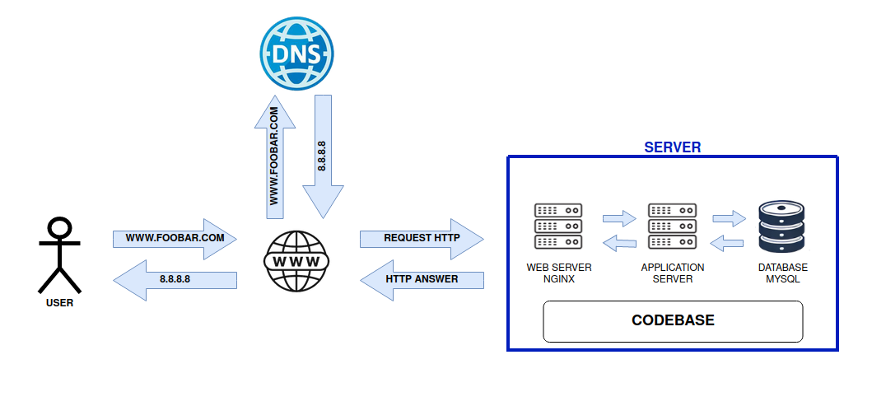

# Explanation of the Infrastructure

## 1. What is a server?
A **server** is a machine (physical or virtual) that hosts applications, databases, or web services and responds to user requests over a network. It plays a key role in managing resources and data, processing requests sent by users.

## 2. What is the role of the domain name?
The **domain name** (in this case, www.foobar.com) allows users to access the server using a readable address instead of a numeric IP address. The domain is translated into an IP address through the DNS (Domain Name System).

## 3. What type of DNS record is www in www.foobar.com?
The **www** in `www.foobar.com` is typically a **CNAME** or **A record**:
- **CNAME (Canonical Name)**: Points to another domain (for example, it could point to the main domain without "www").
- **A record**: Directly links a domain name to an IP address.

## 4. What is the role of the web server?
The **web server** (here, NGINX) handles HTTP requests from users' browsers. It serves static files (HTML, CSS, JavaScript) or forwards dynamic requests to the application server for further processing.

## 5. What is the role of the application server?
The **application server** handles the business logic of dynamic requests. It runs scripts, interacts with the database, and generates dynamic content based on user requests before sending the response back to the web server.

## 6. What is the role of the database?
The **database** stores and manages the data needed by the application. This includes user data, dynamic content, transactions, and more. The application server communicates with the database to retrieve or save information.

## 7. How does the server communicate with the user's computer requesting the website?
The communication between the server and the user's computer happens through protocols like **HTTP/HTTPS** (Hypertext Transfer Protocol/Secure). The HTTP requests sent by the user's browser are received by the web server, which responds by sending the requested pages (HTML, CSS, JS).

# Issues with this Infrastructure

## 1. Single Point of Failure (SPOF)
There is a **single point of failure** in this setup: the single server that handles everything. If this server fails, the entire service goes down, which is a major weakness for availability.

## 2. Downtime during maintenance
If you need to update or redeploy code, you will likely need to restart the web or application server, causing **downtime** during maintenance, which will affect the availability of the site to users.

## 3. Scaling issues
With this single server setup, if **traffic increases significantly**, the server might get overloaded and be unable to handle all the requests. This would result in slower response times or even crashes. There is no system in place to add more servers and spread the load (no load balancing or redundancy).

# Suggested Improvements

- Add a **load balancer** (like HAProxy) to distribute requests across multiple servers and improve availability.
- Set up **backup servers** or a cluster to ensure redundancy and avoid a SPOF.
- Use **continuous deployment** tools to minimize downtime when updating the server.
