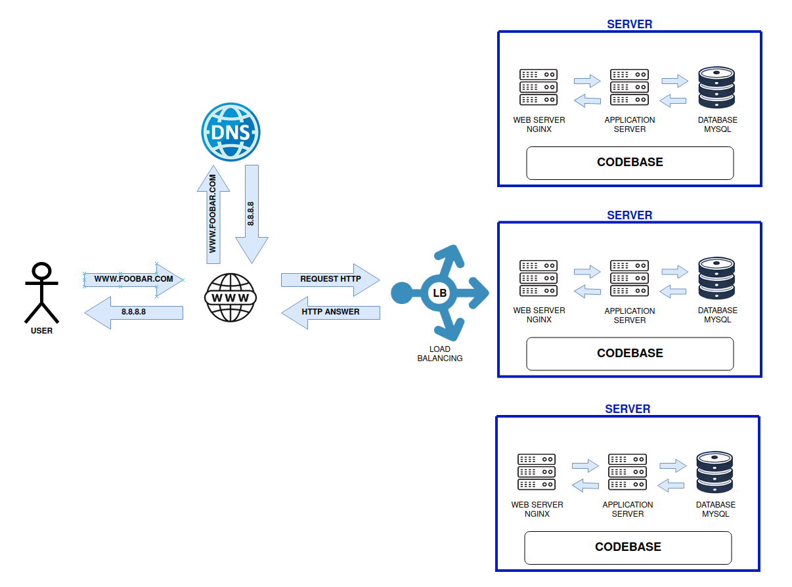

# DISTRIBUTED WEB INFRASTRUCTURE

# Explanation of the Infrastructure

## 1. For every additional element, why are you adding it?
- **Load Balancer (LB)**: 
  The load balancer is added to distribute incoming traffic across multiple servers, improving scalability and ensuring that no single server is overloaded. It also increases availability and reliability by preventing service interruptions if one server goes down.

## 2. What distribution algorithm is your load balancer configured with, and how does it work?
  A **load balancer** can use various algorithms for traffic distribution:
  - **Round Robin**: Distributes requests sequentially across servers.
  - **Least Connections**: Routes requests to the server with the fewest active connections.
  - **IP Hash**: Routes traffic based on the client’s IP address.
  
  In this infrastructure, **Round Robin** or **Least Connections** would be common choices to balance the load evenly across the two servers.

## 3. Is your load balancer enabling an Active-Active or Active-Passive setup?
  - **Active-Active**: Both servers are running and handling traffic simultaneously. If one server fails, the other continues handling traffic without disruption.
  - **Active-Passive**: Only one server is active, while the second server remains on standby. If the active server fails, the passive server takes over.
  
  In this case, the infrastructure looks like an **Active-Active** setup, as both servers are active and handling requests simultaneously.

## 4. How does a database Primary-Replica (Master-Slave) cluster work?
  - **Primary-Replica Setup** (Master-Slave): The **Primary (Master)** server handles all write operations, while the **Replica (Slave)** servers handle read requests. Replicas synchronize data from the primary server to ensure consistency.

## 5. What is the difference between the Primary node and the Replica node in regard to the application?
  - **Primary Node**: Handles all write operations and propagates data to replica nodes.
  - **Replica Node**: Handles read-only queries and synchronizes data from the primary server. It cannot be written to directly by the application.

# Issues with this Infrastructure

## 1. Where are the SPOFs (Single Points of Failure)?
  - **Load Balancer**: The infrastructure has a single load balancer, which is a potential **Single Point of Failure (SPOF)**. If it fails, the entire system becomes inaccessible.
  - **Database**: If there is only one primary database without a failover mechanism, the primary database can also be a SPOF if it fails.

## 2. Security issues (no firewall, no HTTPS)
  - **No Firewall**: The infrastructure does not include a firewall to protect the servers from unauthorized access and malicious traffic.
  - **No HTTPS**: Without HTTPS, the communication between the user and the server is not encrypted, leaving it vulnerable to attacks such as **Man-in-the-Middle (MITM)** attacks.

## 3. No monitoring
  - **No Monitoring System**: The infrastructure lacks a monitoring system. Without real-time monitoring, it’s impossible to detect server failures, high load, or other performance issues, which could delay responses to incidents and affect uptime.

# Suggested Improvements
- Implement **redundant load balancers** to eliminate the SPOF at the load balancing level.
- Use a **database cluster with failover** to remove the SPOF at the database level.
- Add **firewalls** and enforce **HTTPS** to ensure secure communication and protection from external threats.
- Integrate a **monitoring tool** (such as Prometheus, Zabbix, or Nagios) to track system health, performance, and failures in real-time.
