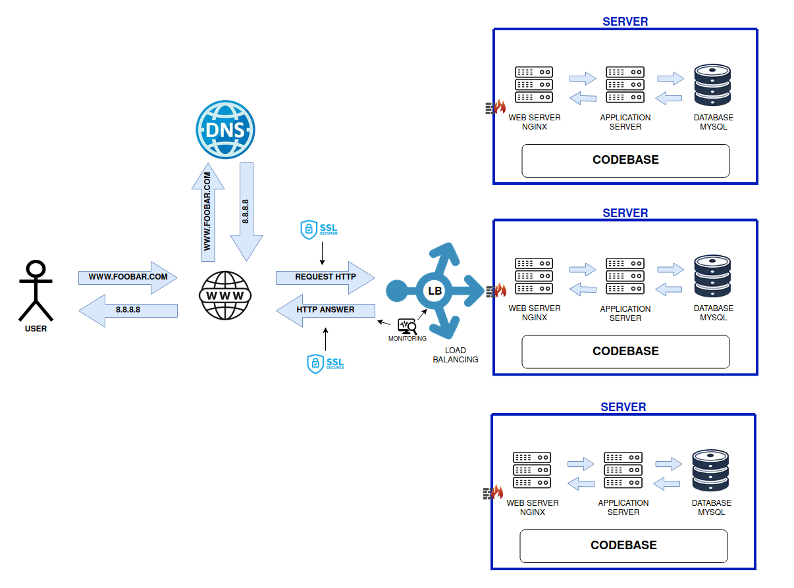

# SECURED AND MONITORED WEB INFRASTRUCTURE

# Explanation of the Infrastructure

## 1. For every additional element, why are you adding it?

- **Firewalls**: Added to protect servers from unauthorized access, filter traffic, and prevent potential attacks such as DDoS, SQL injection, and brute-force attacks.
- **HTTPS (SSL/TLS)**: Added to secure the communication between the user's browser and the web server. Encrypting the data ensures the confidentiality and integrity of the information being exchanged.
- **Monitoring**: Added to observe server performance, track metrics such as CPU usage, memory usage, disk space, and track the availability of services to detect anomalies or potential failures in real-time.

## 2. What are firewalls for?

Firewalls protect the servers by filtering incoming and outgoing network traffic based on pre-defined security rules. They block unauthorized traffic while allowing legitimate traffic through, acting as a first line of defense against network attacks.

## 3. Why is the traffic served over HTTPS?

HTTPS encrypts the communication between the client and the server using SSL/TLS. This protects against **Man-in-the-Middle (MITM)** attacks, ensuring data confidentiality, authentication, and integrity.

## 4. What is monitoring used for?

Monitoring is used to observe the performance and health of infrastructure components, detect potential issues early (such as high CPU usage, memory leaks, server downtime), and gather important data like **QPS (Queries per Second)** or **latency** for future optimization.

## 5. How is the monitoring tool collecting data?

Monitoring tools typically collect data by:
- **Pulling metrics**: The monitoring tool periodically requests metrics from servers via agents or APIs.
- **Pushing metrics**: Servers send metrics to the monitoring tool at regular intervals.

Common monitoring systems like **Prometheus**, **Nagios**, or **Zabbix** use these methods to gather data and trigger alerts if thresholds are crossed.

## 6. How to monitor web server QPS?

To monitor QPS (Queries Per Second) on your web server:
- Configure a monitoring agent (e.g., **Prometheus Node Exporter**).
- Collect data on HTTP requests by instrumenting the web server (e.g., NGINX logs or an application monitoring agent).
- Set up a dashboard using **Grafana** or another visualization tool to monitor the QPS over time.
- Establish alerting rules to notify the team when QPS exceeds expected thresholds.

# Issues with this Infrastructure

## 1. Why is terminating SSL at the load balancer level an issue?

When SSL is terminated at the load balancer, the traffic between the load balancer and the backend servers is not encrypted. This can expose sensitive data if the internal network is compromised. For end-to-end encryption, SSL should be maintained until the traffic reaches the web server.

## 2. Why having only one MySQL server capable of accepting writes is an issue?

Having a single MySQL server for writes creates a **Single Point of Failure (SPOF)**. If this server fails, no new data can be written to the database, causing system outages. Additionally, the server might become a bottleneck under heavy write load. Implementing **Primary-Replica** or **Multi-Primary (Multi-Master)** databases can solve this issue.

## 3. Why having servers with all the same components (database, web server, and application server) might be a problem?

Having all components (database, web server, and application server) on the same servers leads to a lack of **separation of concerns**. This can cause issues like:
- **Resource contention**: Web, application, and database processes compete for the same CPU, memory, and disk resources.
- **Scaling issues**: It is difficult to scale independently based on the load (e.g., scaling only the web server without affecting the database).
- **Security risks**: A breach in one service (e.g., web server) could expose the entire server, including the database.

To avoid these issues, it’s better to decouple services, allowing independent scaling and improved resource allocation.
