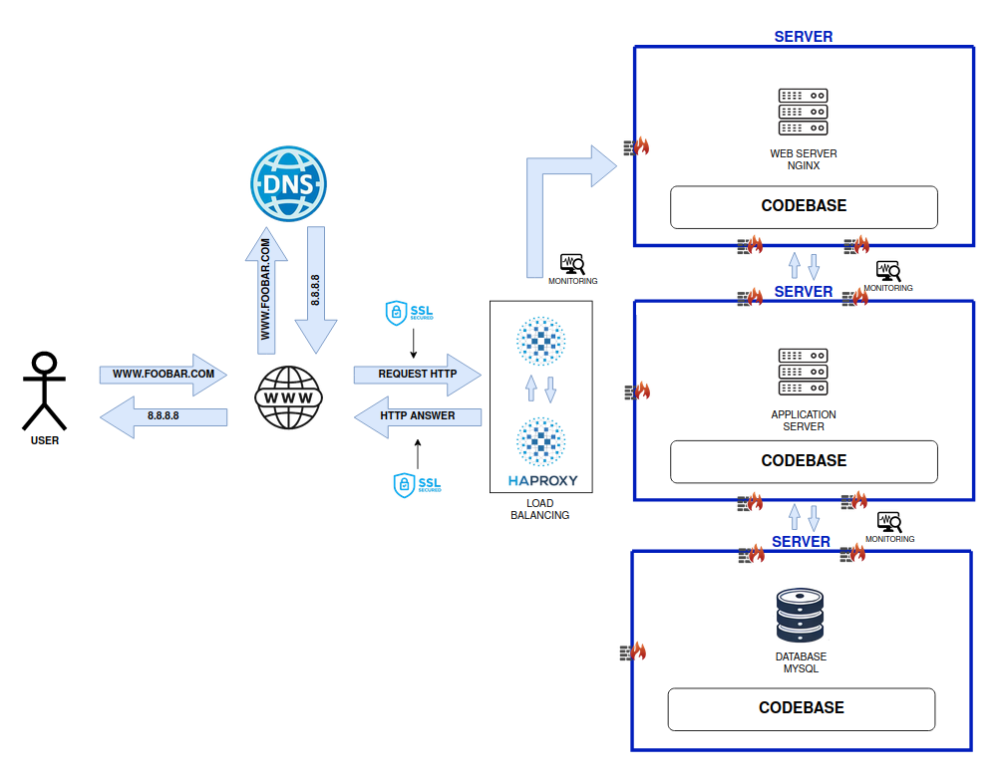

# SCALE UP

# Explanation of New Elements in the Infrastructure

## 1. Additional HAProxy Load Balancer (Cluster Configuration):
- **Purpose**: To create a high-availability (HA) setup for load balancing.
- **Why?**: In the previous infrastructure, a single HAProxy load balancer was a single point of failure. Adding another HAProxy in a cluster configuration ensures that if one load balancer fails, the other can continue distributing traffic, maintaining uptime.
- **How It Works**: 
  - The two HAProxy instances are configured in a **cluster mode** using a virtual IP address (VIP) managed by tools like Keepalived. This allows seamless failover between the two load balancers.
  - **Benefit**: Reduces the risk of downtime due to load balancer failure and provides better **fault tolerance** and **scalability** for high traffic loads.

## 2. Dedicated Servers for Each Component:
- **Split Web Server, Application Server, and Database Server**:
  - **Why?**: In the previous design, there was a lack of separation of concerns, with all components (web server, application server, and database) potentially sharing resources on the same machine.
  - **How It Works**: Each server is dedicated to a single role:
    - **Web Server (Nginx)**: Handles static content and HTTP requests.
    - **Application Server**: Hosts the core application logic.
    - **Database Server (MySQL)**: Handles data storage and queries.
  - **Benefit**:
    - **Resource Isolation**: Each server can be optimized for its specific role (e.g., Nginx can be optimized for network I/O, the application server for CPU usage, and the database server for disk I/O).
    - **Independent Scaling**: Each component can be scaled independently based on the load it experiences (e.g., scale the application server without affecting the database).
    - **Fault Isolation**: A failure in one server (e.g., the application server) won't affect the others.

## 3. HAProxy Configuration for Clustering:
- **Why?**: To enhance fault tolerance and availability of load balancing.
- **How It Works**: The HAProxy cluster distributes incoming traffic evenly among the backend servers. In the event of one HAProxy node failure, the other one can seamlessly take over without disrupting service.
- **Benefit**: Ensures continuous availability of load balancing, reduces the risk of bottlenecks, and improves resilience against failures.

---

These changes focus on increasing the **resilience**, **scalability**, and **performance** of the infrastructure while also reducing **single points of failure**. The infrastructure is now better equipped to handle high loads and server failures without affecting overall availability.

# Issues with this Infrastructure

## Single Point of Failure in Backend Servers:
While the system has two HAProxy load balancers (inferred from your note), there are no redundancy mechanisms for the backend servers (Nginx, application server, database).
- **Impact**: If the application server or the database server goes down, the entire application could become unavailable, even though the load balancers are functional.
- **Solution**: Implement redundant web servers, application servers, and database servers in active-passive or active-active configurations. This will ensure high availability and failover support.

## No Database Redundancy:
The current infrastructure has one MySQL database server, which creates a bottleneck and a single point of failure for data storage.
- **Impact**: If the database server fails, the entire application will lose access to its data, leading to downtime.
- **Solution**: Add a MySQL replication setup (master-slave or master-master) to ensure data redundancy and allow failover in case of a primary database failure.

## Potential Application Server Bottleneck:
The application server in the current design is centralized. As the load increases, it may not be able to handle all incoming requests efficiently.
- **Impact**: High traffic or resource-intensive tasks may slow down the server, leading to performance degradation.
- **Solution**: Horizontal scaling of the application server by adding more instances behind the load balancer. The load balancer can distribute traffic across multiple application servers to ensure better performance.

## Lack of Web Server Redundancy:
There is only one Nginx web server, which processes all incoming HTTP requests.
- **Impact**: If the web server fails, the application becomes unreachable, causing downtime for the users.
- **Solution**: Implement a cluster of web servers (multiple Nginx instances) so that the HAProxy load balancer can distribute the load across them, ensuring high availability.

## Increased Complexity with SSL Management:
SSL/TLS termination is not clearly outlined in the diagram. It's unclear whether the SSL termination is done at HAProxy or at the individual backend servers.
- **Impact**: If SSL is terminated at multiple points, it increases management complexity and security risks.
- **Solution**: Ideally, SSL termination should be handled at the HAProxy layer to offload this responsibility from the backend servers, simplifying the architecture and improving performance.